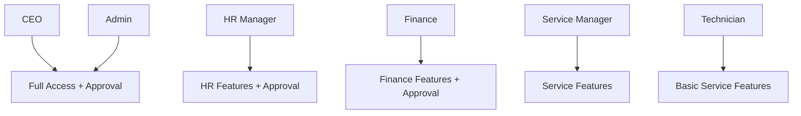

# Role-Based Permissions & Menu System

## Overview
The AK Success CRM now implements department-based menu visibility and approval permissions using existing roles. The system has two layers:
1. **Role-based menu visibility** (frontend + backend API enforcement)
2. **Approval permissions** for sensitive actions (leave requests, invoice payments)

## User Roles

### Existing Roles
- `ceo` - Chief Executive Officer (full access + approval)
- `admin` - Administrator (full access + approval)
- `hr_manager` - HR Manager (HR features + approval)
- `finance` - Finance Manager (finance features + approval)
- `service_manager` - Service Manager (service features, no approval)
- `technician` - Technician (basic service features, no approval)

## Menu Visibility by Role

### Frontend Menu Configuration
Located in: `frontend/src/components/layout/Sidebar.tsx`

| Menu Item | Visible To |
|-----------|------------|
| Dashboard | All |
| Executive View | `ceo`, `admin` |
| Clients | All |
| Service Tickets | All |
| Equipment | All |
| Robots | All |
| Inventory | All |
| HR & Leave | `ceo`, `admin`, `hr_manager` |
| Employees | `ceo`, `admin`, `hr_manager` |
| Accounts | `ceo`, `admin`, `finance` |
| Suppliers | `ceo`, `admin`, `service_manager` |
| User Management | `ceo`, `admin` |
| Settings | All |

### Backend API Permissions
Enforced by `requireRole()` middleware in route handlers.

## Approval System

### Can Approve Flag
Users have a `can_approve` boolean field that determines if they can approve sensitive actions.

**Default Approval Permissions:**
- `ceo` → `can_approve: true`
- `admin` → `can_approve: true`
- `hr_manager` → `can_approve: true`
- `finance` → `can_approve: true`
- `service_manager` → `can_approve: false`
- `technician` → `can_approve: false`

### Approval-Gated Actions

#### 1. Leave Request Approval
**Endpoint:** `PATCH /api/leave/:id/status`
**Requirements:**
- Role: `ceo`, `admin`, or `hr_manager`
- AND `can_approve: true`

**Action:** Approve or reject employee leave requests

#### 2. Invoice Payment Recording
**Endpoint:** `PATCH /api/invoices/:id/payment`
**Requirements:**
- Role: `ceo`, `admin`, or `finance`
- AND `can_approve: true`

**Action:** Record payments for invoices (significant financial action)

## Implementation Details

### Database Schema
**Table:** `users`
```sql
ALTER TABLE users ADD COLUMN can_approve TINYINT DEFAULT 0;
```

### Backend Middleware
**File:** `backend/src/middleware/auth.js`

Two middleware functions:
1. `requireRole(...roles)` - Checks user role
2. `requireApproval` - Checks `can_approve` flag

### Frontend Integration
**Auth Store:** `frontend/src/stores/authStore.ts`

New method: `canApprove()` returns boolean indicating approval permission.

**Usage in components:**
```typescript
const { canApprove } = useAuthStore();

if (canApprove()) {
  // Show approval buttons
}
```

### JWT Token Payload
Token now includes:
```json
{
  "id": "user-id",
  "email": "user@example.com",
  "role": "admin",
  "can_approve": true
}
```

## Setting Up New Users

### Via API (Recommended)
```bash
POST /api/auth/register
{
  "email": "newuser@example.com",
  "name": "New User",
  "password": "securePassword",
  "role": "finance",
  "department": "Finance"
}
```

Then update approval permission:
```sql
UPDATE users SET can_approve = 1 WHERE email = 'newuser@example.com';
```

## Admin: Managing Users

### 1. Edit User Details
**Endpoint:** `PUT /api/auth/users/:id`

Update user's basic information (name, email, department, phone, avatar).

**Request Body:**
```json
{
  "name": "Updated Name",
  "email": "newemail@example.com",
  "department": "Finance",
  "phone": "+60 12-345 6789",
  "avatar": "https://example.com/avatar.jpg"
}
```

**Example:**
```bash
PUT /api/auth/users/user-id-here
Authorization: Bearer <admin-token>

{
  "name": "John Doe Updated",
  "department": "Finance Department"
}
```

### 2. Update User Permissions
**Endpoint:** `PUT /api/auth/users/:id/permissions`

Change user's role, approval permissions, and account status.

**Request Body:**
```json
{
  "role": "finance",
  "department": "Finance",
  "can_approve": true,
  "is_active": true
}
```

**Example: Grant Approval Permission**
```bash
PUT /api/auth/users/user-id-here/permissions
Authorization: Bearer <admin-token>
Content-Type: application/json

{
  "can_approve": true
}
```

**Example: Change Role and Department**
```bash
PUT /api/auth/users/user-id-here/permissions
Authorization: Bearer <admin-token>

{
  "role": "hr_manager",
  "department": "Human Resources",
  "can_approve": true
}
```

**Example: Revoke Approval Permission**
```bash
PUT /api/auth/users/user-id-here/permissions
Authorization: Bearer <admin-token>

{
  "can_approve": false
}
```

**Valid Roles:**
- `ceo`
- `admin`
- `hr_manager`
- `finance`
- `service_manager`
- `technician`

### 3. Delete User (Deactivate)
**Endpoint:** `DELETE /api/auth/users/:id`

Deactivates a user account (soft delete - preserves data).

**Example:**
```bash
DELETE /api/auth/users/user-id-here
Authorization: Bearer <admin-token>
```

**Response:**
```json
{
  "message": "User deactivated successfully",
  "id": "user-id-here"
}
```

**Note:** This performs a soft delete by setting `is_active = 0`. The user data is preserved but the account cannot login.

## Safety Features

**Edit User:**
- Prevents duplicate email addresses
- Only admins/CEOs can edit users
- Validates all input fields

**Update Permissions:**
- Admins cannot demote themselves from admin/CEO role
- Only CEO and admin can use this endpoint
- User must exist (404 if not found)
- Invalid roles are rejected

**Delete User:**
- Prevents self-deletion
- Soft delete (deactivates account, preserves data)
- Only admins/CEOs can delete users
- Cannot delete non-existent users

### Via Database Seed
When initializing the database, set `can_approve` based on role:
```javascript
const users = [
  { role: 'ceo', can_approve: 1 },
  { role: 'admin', can_approve: 1 },
  { role: 'hr_manager', can_approve: 1 },
  { role: 'finance', can_approve: 1 },
  { role: 'service_manager', can_approve: 0 },
  { role: 'technician', can_approve: 0 }
];
```

## Permission Hierarchy



## Common Operations

### Via API (Recommended for Admins)

#### 1. Edit User Basic Details
```bash
# Update name, email, department
PUT /api/auth/users/{user-id}
Authorization: Bearer <admin-token>

{
  "name": "John Doe",
  "email": "john.doe@example.com",
  "department": "Finance",
  "phone": "+60 12-345 6789"
}
```

#### 2. Grant Approval Permission to Employee
```bash
# 1. Get user ID from /api/auth/users
GET /api/auth/users

# 2. Update permissions
PUT /api/auth/users/{user-id}/permissions
{
  "can_approve": true
}
```

#### 3. Change Employee Department and Role
```bash
PUT /api/auth/users/{user-id}/permissions
{
  "role": "finance",
  "department": "Finance Department",
  "can_approve": true
}
```

#### 4. Deactivate User Account (Soft Delete)
```bash
# Option 1: Via permissions endpoint
PUT /api/auth/users/{user-id}/permissions
{
  "is_active": false
}

# Option 2: Via delete endpoint (recommended)
DELETE /api/auth/users/{user-id}
```

#### 5. Reactivate Deactivated User
```bash
PUT /api/auth/users/{user-id}/permissions
{
  "is_active": true
}
```

### Via SQL (Direct Database Access)

#### Grant Approval Permission
```sql
UPDATE users SET can_approve = 1 WHERE email = 'user@example.com';
```

#### Revoke Approval Permission
```sql
UPDATE users SET can_approve = 0 WHERE email = 'user@example.com';
```

#### Change Role and Department
```sql
UPDATE users 
SET role = 'hr_manager', department = 'HR', can_approve = 1 
WHERE email = 'user@example.com';
```

#### Check User Permissions
```sql
SELECT email, role, department, can_approve, is_active 
FROM users 
WHERE email = 'user@example.com';
```

## Real-World Workflow Example

**Scenario:** Admin wants to promote a technician to service manager with approval rights

1. **Admin logs in** and gets authentication token

2. **List all users** to find the technician:
   ```bash
   GET /api/auth/users
   Authorization: Bearer <admin-token>
   ```

3. **Update the user's permissions**:
   ```bash
   PUT /api/auth/users/tech-user-id/permissions
   Authorization: Bearer <admin-token>
   
   {
     "role": "service_manager",
     "department": "Service Operations",
     "can_approve": true
   }
   ```

4. **User must re-login** to get updated JWT token with new permissions

5. **Verify**: User can now:
   - Access service manager menu items
   - Approve leave requests (if hr_manager role was also granted)
   - View and manage service operations

## Migration Notes

### Existing Users
When upgrading existing systems, `can_approve` defaults to `0`. Update existing users:

```sql
-- Grant approval to specific roles
UPDATE users SET can_approve = 1 
WHERE role IN ('ceo', 'admin', 'hr_manager', 'finance');
```

### Seed Scripts
- `backend/src/db/init-mysql.js` - MySQL seed with `can_approve`
- `backend/src/db/init.js` - JSON DB seed with `can_approve`

Both scripts now require `SEED_PASSWORD` environment variable for security.

## Troubleshooting

### Issue: User cannot approve leave/invoices
**Check:**
1. User has correct role (`ceo`, `admin`, `hr_manager`, or `finance`)
2. User has `can_approve = 1` in database
3. JWT token is fresh (logout/login to refresh token with new permissions)

### Issue: Menu items not visible
**Check:**
1. User role matches menu visibility rules in `Sidebar.tsx`
2. Frontend `hasPermission()` logic in `authStore.ts`

### Issue: API returns 403 Forbidden
**Check:**
1. Route has correct `requireRole()` middleware
2. For approval actions, check `requireApproval` middleware is present
3. User token is valid and contains correct role/permissions

## Frontend Integration Guide

### Using the User Management API in Frontend

**Example: Admin UI Component**
```typescript
// In your admin user management component
import { api } from '../services/api';

// 1. Edit user details
const editUser = async (userId: string, updates: {
  name?: string;
  email?: string;
  department?: string;
  phone?: string;
}) => {
  try {
    const response = await api.updateUser(userId, updates);
    console.log('User updated:', response);
    alert('User details updated successfully');
  } catch (error) {
    console.error('Failed to update user:', error);
  }
};

// 2. Update user permissions
const updateUserPermissions = async (userId: string, updates: {
  role?: string;
  department?: string;
  can_approve?: boolean;
  is_active?: boolean;
}) => {
  try {
    const response = await api.updateUserPermissions(userId, updates);
    console.log('Permissions updated:', response);
    alert('Permissions updated. User must re-login for changes to take effect.');
  } catch (error) {
    console.error('Failed to update permissions:', error);
  }
};

// 3. Delete (deactivate) user
const deleteUser = async (userId: string) => {
  if (!confirm('Are you sure you want to deactivate this user?')) return;
  
  try {
    const response = await api.deleteUser(userId);
    console.log('User deactivated:', response);
    alert('User account has been deactivated');
    // Refresh user list
  } catch (error) {
    console.error('Failed to delete user:', error);
  }
};

// Usage in component
<div className="user-actions">
  {/* Edit button */}
  <button onClick={() => editUser(user.id, {
    name: 'Updated Name',
    department: 'Finance'
  })}>
    Edit User
  </button>
  
  {/* Grant approval button */}
  <button onClick={() => updateUserPermissions(user.id, {
    can_approve: true,
    role: 'finance'
  })}>
    Grant Approval Permission
  </button>
  
  {/* Delete button */}
  <button onClick={() => deleteUser(user.id)}>
    Delete User
  </button>
</div>
```

**Add to API Service** (`frontend/src/services/api.ts`):
```typescript
// Edit user details
updateUser: async (userId: string, updates: {
  name?: string;
  email?: string;
  department?: string;
  phone?: string;
  avatar?: string;
}) => {
  return request(`/auth/users/${userId}`, {
    method: 'PUT',
    body: JSON.stringify(updates),
  });
},

// Update user permissions
updateUserPermissions: async (userId: string, updates: {
  role?: string;
  department?: string;
  can_approve?: boolean;
  is_active?: boolean;
}) => {
  return request(`/auth/users/${userId}/permissions`, {
    method: 'PUT',
    body: JSON.stringify(updates),
  });
},

// Delete user (soft delete)
deleteUser: async (userId: string) => {
  return request(`/auth/users/${userId}`, {
    method: 'DELETE',
  });
}
```

### Displaying Approval Badge in UI

```typescript
// In user list or profile component
{user.canApprove && (
  <span className="badge-success">
    Can Approve
  </span>
)}
```

## Future Enhancements

Potential additions:
1. Multi-level approvals (Level 1, Level 2, Level 3)
2. Department-specific approval chains
3. Approval thresholds (e.g., amounts requiring higher approval)
4. Approval audit logs
5. Custom permission sets beyond roles
6. Bulk permission updates
7. Permission templates (e.g., "Finance Manager Template")
