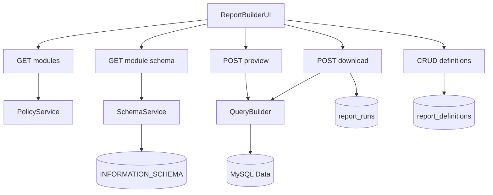

# Dynamic Report Module Architecture

## Purpose

This module provides schema-driven report generation for existing CRM modules. Users can:

- choose a module (table)
- choose columns dynamically from schema metadata
- apply filters/sort/pagination
- preview rows
- download CSV/XLSX
- save reusable report definitions

The architecture is designed to avoid hardcoded report templates and support future tables with minimal code changes.

## Existing Module Coverage

Primary reportable modules:

- `clients`
- `equipment`
- `inventory`
- `tickets`
- `invoices`
- `suppliers`
- `users`
- `employees`
- `leave_requests`
- `stock_movements`
- `ticket_parts`
- `inventory_serial_numbers`
- `audit_logs`

## High-Level Flow

## Backend Components

### 1) Schema Service

- Reads database column metadata from `INFORMATION_SCHEMA.COLUMNS`.
- Returns per-column:
  - name
  - sql type
  - nullability
  - default
  - suggested operators
- Keeps module-to-table mapping centralized.

### 2) Policy Service

- Enforces module allowlist by role.
- Removes sensitive columns from all roles (for example `password`, `token`, `secret` patterns).
- Enforces ownership/public rules for saved definitions.

### 3) Query Builder

- Accepts structured config (not raw SQL).
- Validates selected columns and filter/sort fields against allowed schema.
- Generates parameterized SQL only.
- Supports:
  - operators: `eq`, `neq`, `like`, `gt`, `gte`, `lt`, `lte`, `in`, `between`, `is_null`, `is_not_null`
  - pagination and sort

### 4) Export Pipeline

- Uses the same validated query config as preview.
- CSV export: text stream-friendly format.
- XLSX export: workbook generation using `xlsx`.
- Records each download run in `report_runs`.

### 5) Saved Report Definitions

- Stores reusable report settings in `report_definitions`.
- Supports user-owned private reports and shared public reports.

## API Contract

### Metadata

- `GET /api/reports/modules`
  - response: reportable modules for current role

- `GET /api/reports/modules/:module/schema`
  - response: allowed columns + metadata for selected module

### Execution

- `POST /api/reports/preview`
  - request:
    - `module`
    - `columns[]`
    - `filters[]`
    - `sort`
    - `page`, `pageSize`
  - response:
    - `rows[]`
    - `total`
    - paging info

- `POST /api/reports/download`
  - request:
    - same as preview
    - `format` (`csv` | `xlsx`)
  - response:
    - file stream with download headers

### Saved Reports

- `POST /api/reports/definitions`
- `GET /api/reports/definitions`
- `PUT /api/reports/definitions/:id`
- `DELETE /api/reports/definitions/:id`

## Data Model

### `report_definitions`

- `id` PK
- `name`
- `module_key`
- `config_json`
- `is_public`
- `owner_user_id`
- `created_at`
- `updated_at`

### `report_runs`

- `id` PK
- `report_definition_id` nullable
- `requested_by`
- `module_key`
- `format`
- `status`
- `row_count`
- `error_message`
- `created_at`

### Optional `report_column_policies`

- `id` PK
- `module_key`
- `column_name`
- `allowed_roles_json`
- `is_blocked`

## Security Controls

- Authentication required for all report routes.
- Module and column access controlled by role.
- Sensitive columns blocked globally.
- Query builder prevents SQL injection via:
  - strict allowlists
  - parameter binding
  - operator whitelist
- Server-enforced row limits and pagination caps.
- Report run audit trail in `report_runs`.

## Performance Controls

- Preview uses pagination and count query.
- Download has maximum row limit.
- Optional asynchronous export can be introduced later if large datasets are required.

## Frontend UX

- Report Builder page with:
  - module selector
  - column multi-select
  - filter builder (column/operator/value)
  - preview grid
  - CSV/XLSX download buttons
  - save/load/delete report definitions

## Acceptance Criteria

- Users can dynamically generate reports for all allowed modules.
- Users can choose relevant columns from module schema.
- Preview and download return consistent data.
- Sensitive fields are never exposed.
- Saved report definitions are reusable and access-controlled.
